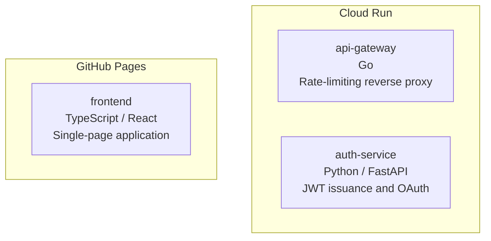

# svccat

**Service catalog drift detection for multi-service repositories.**

svccat reads your declared service manifest and compares it against what
actually exists in the repo — flagging missing services, undeclared additions,
and stale metadata before they become operational toil.

---

## Why svccat?

In any multi-service repo the architecture docs, service inventory, and the
codebase evolve at different speeds. A new service appears in `services/` but
never makes it into the manifest. A deprecated service stays in the YAML long
after the directory is gone. `docs:` and `ci:` references silently rot.

svccat makes drift visible in your terminal and in CI, so your declared
architecture stays honest.

---

## Installation

```bash
cargo install svccat
```

Or build from source:

```bash
git clone https://github.com/rodmen07/svccat
cd svccat
cargo build --release
# binary at target/release/svccat
```

---

## Quick start

```
svccat init                         # scaffold services.yaml from your repo
svccat check                        # inspect drift in the current repo
svccat check --fail-on-drift        # gate CI on zero drift (exit 1 on drift)
svccat check --format json          # machine-readable output
svccat graph                        # Mermaid diagram grouped by platform
svccat graph --format markdown      # Markdown table
svccat export --format json         # full catalog snapshot with drift
svccat export --format markdown     # Markdown catalog + drift table
```

Manifest is auto-detected: svccat tries `svccat.yaml`, `svccat.yml`,
`services.yaml`, `services.yml` in order.

---

## `svccat init`

Bootstrap a `services.yaml` in seconds by letting svccat discover what's
already in your repo:

```bash
svccat init            # writes services.yaml in the current directory
svccat init --force    # overwrite an existing file
svccat init --output path/to/svccat.yaml   # custom output path
```

The generated file includes every detected service with language inferred from
marker files (`Cargo.toml` → Rust, `go.mod` → Go, `package.json` → TypeScript,
`pyproject.toml` / `requirements.txt` → Python), plus `~` placeholders for
`platform`, `role`, and `url` that you fill in before committing.

Example output:

```yaml
# Generated by `svccat init`
# Fill in the ~placeholder~ fields and commit this file.
# Run `svccat check` to verify there is no drift.

version: "1"

discovery:
  paths:
    - services/*
    - microservices/*
    - apps/*
    - packages/*

services:
  - name: api-gateway
    path: services/api-gateway
    language: Go
    platform: ~  # e.g. gcp-cloud-run, fly.io, vercel, aws-lambda
    role: ~      # e.g. api, worker, frontend, database
    url: ~       # e.g. https://my-service.example.com
  - name: auth-service
    path: services/auth-service
    language: Rust
    platform: ~
    role: ~
    url: ~
```

---

## Manifest format

```yaml
# svccat.yaml  (or services.yaml for backwards compat)
version: "1"

# Optional: configure how svccat discovers services in the repo.
discovery:
  paths:                  # glob patterns for candidate service directories
    - "services/*"
    - "microservices/*"
  markers:                # files that identify a directory as a service
    - Cargo.toml
    - Dockerfile
    - go.mod
    - package.json
    - pyproject.toml
    - requirements.txt

services:
  - name: api-gateway               # required
    language: Go                    # recommended
    platform: Cloud Run             # recommended
    role: Rate-limiting reverse proxy  # required (error if missing)
    url: https://gateway.example.com   # optional
    path: infra/gateway             # optional: explicit path (overrides name matching)
    submodule: go-gateway           # optional: git submodule path (Portfolio-compatible)
    docs: docs/api-gateway.md       # optional: warn if file missing
    ci: .github/workflows/api-gateway.yml  # optional: warn if file missing
```

### Default discovery paths

When `discovery.paths` is empty svccat tries `services/*`, `microservices/*`,
`apps/*`, and `packages/*`.

### Matching declared ↔ discovered

1. If the entry has `path:` → check that path exists.
2. Else if the entry has `submodule:` → check that path exists.
3. Else → match by name against discovered service directory names.

---

## Drift types

| Kind | Severity | Description |
|------|----------|-------------|
| `declared_missing_from_repo` | **error** | Service is in the manifest but its directory is not found in the repo. |
| `undeclared_in_repo` | warning | A service directory was discovered but is not listed in the manifest. |
| `missing_field` | error / warning | A recommended metadata field is absent (`role` = error; `language`, `platform` = warning). |
| `missing_referenced_file` | warning | A `docs:` or `ci:` path is declared but the file does not exist. |

---

## CI integration

Add a step to your pipeline to gate merges on zero drift:

```yaml
# .github/workflows/catalog.yml
name: Catalog check
on: [push, pull_request]

jobs:
  catalog:
    runs-on: ubuntu-latest
    steps:
      - uses: actions/checkout@v4
      - uses: actions-rs/toolchain@v1
        with: { toolchain: stable }
      - run: cargo install svccat
      - run: svccat check --fail-on-drift
```

Exit codes:
- `0` — no drift (or drift present but `--fail-on-drift` not set)
- `1` — drift detected and `--fail-on-drift` is set
- `2` — fatal error (unreadable manifest, parse failure, etc.)

---

## Example output

### Terminal

```
svccat: 3 declared, 3 discovered  [services.yaml]

  OK  No drift detected
```

```
svccat: 4 declared, 3 discovered  [services.yaml]

  DRIFT DETECTED  (1 error, 2 warnings)

  x  [MISSING]     'legacy-worker' is declared in the manifest but not found in the repo
  !  [UNDECLARED]  'services/experimental-api' exists in the repo but is not listed in the manifest
  !  [FIELD]       'event-stream' is missing recommended field: platform

  x  1 error(s)
  !  2 warning(s)
```

### Mermaid graph (`svccat graph`)

````markdown

````

---

## Try the sample monorepo

```bash
cd examples/sample-monorepo
svccat check
svccat graph
svccat export --format json
```

---

## Project status

`v0.1` — core drift detection, terminal/JSON/Mermaid/Markdown output, CI integration.

Planned for later releases:
- `depends_on` edges in `svccat graph` for explicit dependency graphs
- Remote URL health checks (`svccat check --ping`)
- Config file (`svccat.toml`) for workspace-level defaults
- GitHub Actions action for zero-install CI usage

---

## Contributing

Bug reports and pull requests welcome.  
Please run `cargo clippy -- -D warnings` and `cargo fmt` before opening a PR.

## License

MIT — see [LICENSE](LICENSE).
