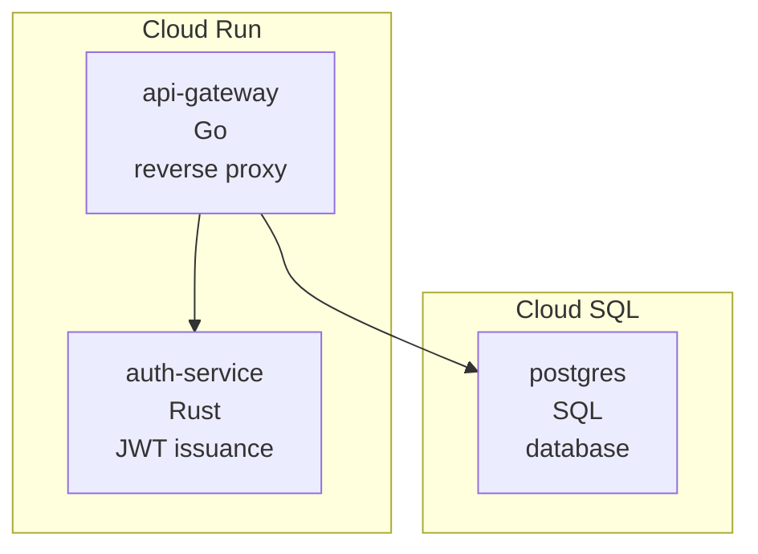
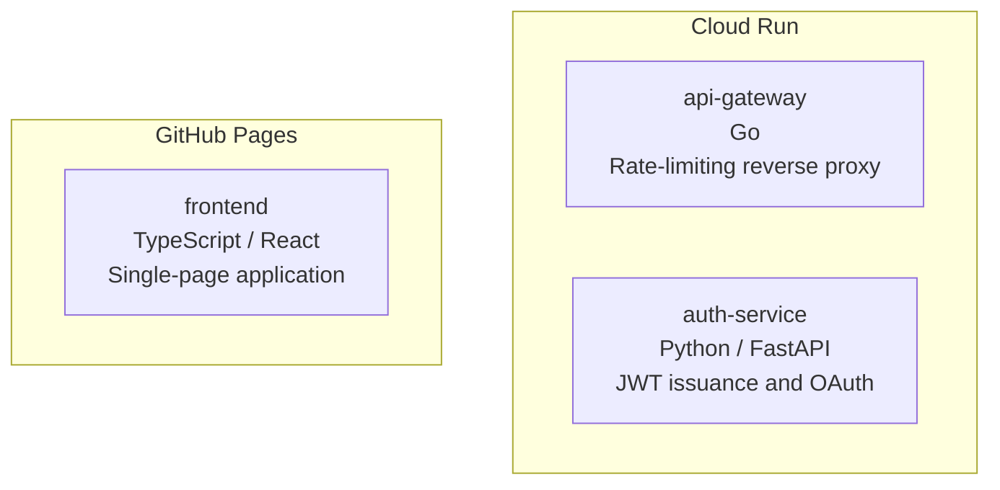

# svccat

[](https://github.com/rodmen07/svccat/actions/workflows/ci.yml)
[](https://crates.io/crates/svccat)
[](https://crates.io/crates/svccat)
[](LICENSE)

**Service catalog drift detection for multi-service repositories.**

svccat reads your declared service manifest and compares it against what
actually exists in the repo — flagging missing services, undeclared additions,
and stale metadata before they become operational toil.

---

## Why svccat?

In any multi-service repo the architecture docs, service inventory, and the
codebase evolve at different speeds. A new service appears in `services/` but
never makes it into the manifest. A deprecated service stays in the YAML long
after the directory is gone. `docs:` and `ci:` references silently rot.

svccat makes drift visible in your terminal and in CI, so your declared
architecture stays honest.

---

## Installation

```bash
cargo install svccat
```

Or build from source:

```bash
git clone https://github.com/rodmen07/svccat
cd svccat
cargo build --release
# binary at target/release/svccat
```

---

## Quick start

```
svccat init                              # scaffold services.yaml from your repo
svccat check                             # inspect drift in the current repo
svccat check --fail-on-drift             # gate CI on zero drift (exit 1 on drift)
svccat check --team platform             # only check services owned by "platform"
svccat check --ignore "examples/*"       # skip directories matching the pattern
svccat check --format json               # machine-readable output
svccat graph                             # Mermaid diagram grouped by platform
svccat graph --format markdown           # Markdown table
svccat export --format json > snap.json  # save a catalog snapshot
svccat diff before.json after.json       # compare two snapshots
svccat watch                             # continuous drift detection (re-runs on changes)
svccat completions bash                  # print bash completion script
```

Manifest is auto-detected: svccat tries `svccat.yaml`, `svccat.yml`,
`services.yaml`, `services.yml` in order.

---

## `svccat init`

Bootstrap a `services.yaml` in seconds by letting svccat discover what's
already in your repo:

```bash
svccat init            # writes services.yaml in the current directory
svccat init --force    # overwrite an existing file
svccat init --output path/to/svccat.yaml   # custom output path
```

The generated file includes every detected service with language inferred from
marker files (`Cargo.toml` → Rust, `go.mod` → Go, `package.json` → TypeScript,
`pyproject.toml` / `requirements.txt` → Python), plus `~` placeholders for
`platform`, `role`, and `url` that you fill in before committing.

Example output:

```yaml
# Generated by `svccat init`
# Fill in the ~placeholder~ fields and commit this file.
# Run `svccat check` to verify there is no drift.

version: "1"

discovery:
  paths:
    - services/*
    - microservices/*
    - apps/*
    - packages/*

services:
  - name: api-gateway
    path: services/api-gateway
    language: Go
    platform: ~  # e.g. gcp-cloud-run, fly.io, vercel, aws-lambda
    role: ~      # e.g. api, worker, frontend, database
    url: ~       # e.g. https://my-service.example.com
  - name: auth-service
    path: services/auth-service
    language: Rust
    platform: ~
    role: ~
    url: ~
```

---

## Manifest format

```yaml
# svccat.yaml  (or services.yaml for backwards compat)
version: "1"

# Optional: configure how svccat discovers services in the repo.
discovery:
  paths:                  # glob patterns for candidate service directories
    - "services/*"
    - "microservices/*"
  markers:                # files that identify a directory as a service
    - Cargo.toml
    - Dockerfile
    - go.mod
    - package.json
    - pyproject.toml
    - requirements.txt
  ignore:                 # paths to exclude from discovery
    - "services/examples"
    - "services/vendor/*"

policy:
  require_fields:         # every service must declare these fields (error if missing)
    - url
    - language
    - platform

services:
  - name: api-gateway               # required
    language: Go                    # recommended
    platform: Cloud Run             # recommended
    role: Rate-limiting reverse proxy  # required (error if missing)
    url: https://gateway.example.com   # optional: enables --ping health checks
    team: platform                  # optional: owning team name
    oncall: platform@example.com    # optional: on-call contact (email, handle, PD service)
    path: infra/gateway             # optional: explicit path (overrides name matching)
    submodule: go-gateway           # optional: git submodule path (Portfolio-compatible)
    docs: docs/api-gateway.md       # optional: warn if file missing
    ci: .github/workflows/api-gateway.yml  # optional: warn if file missing
    depends_on:                     # optional: rendered as edges in svccat graph
      - auth-service
      - postgres
```

### Default discovery paths

When `discovery.paths` is empty svccat tries `services/*`, `microservices/*`,
`apps/*`, and `packages/*`.

### Matching declared ↔ discovered

1. If the entry has `path:` → check that path exists.
2. Else if the entry has `submodule:` → check that path exists.
3. Else → match by name against discovered service directory names.

---

## Drift types

| Kind | Severity | Description |
|------|----------|-------------|
| `declared_missing_from_repo` | **error** | Service is in the manifest but its directory is not found in the repo. |
| `undeclared_in_repo` | warning | A service directory was discovered but is not listed in the manifest. |
| `missing_field` | error / warning | A recommended metadata field is absent (`role` = error; `language`, `platform` = warning). |
| `missing_referenced_file` | warning | A `docs:` or `ci:` path is declared but the file does not exist. |

---

## `svccat diff` — compare snapshots

Track how your catalog evolves over time by diffing two JSON snapshots:

```bash
# Save a snapshot before making changes
svccat export --format json > before.json

# ... update services.yaml or add/remove services ...

# Save a snapshot after
svccat export --format json > after.json

# Show what changed
svccat diff before.json after.json
```

Example output:

```
svccat diff: before.json → after.json

  Services added (1):
    +  new-worker

  Services removed (1):
    -  legacy-api

  Services changed (1):
    ~  auth-service
       language: Python → Rust

  Resolved drift (1):
    ✓  [ERROR] legacy-api — 'legacy-api' is declared in the manifest but not found in the repo
```

---

## Policy rules

Enforce field requirements across all services via the `policy:` section in
your manifest:

```yaml
policy:
  require_fields:
    - url        # every service must have a health-check URL
    - language   # documentation requirement
    - platform   # deployment target must be explicit
```

Any service missing a required field is flagged as an error-level drift item:

```
x  [POLICY]  'worker-service' violates policy: required field 'url' is missing
```

Policy violations count toward `--fail-on-drift` and `fail_on_drift` in
`svccat.toml`.

---

## Ownership metadata — `team` and `oncall`

Declare service ownership directly in your manifest so every entry has a clear
owner:

```yaml
services:
  - name: api-gateway
    team: platform        # owning team name
    oncall: platform@example.com   # on-call contact (email, handle, or PD service)
  - name: billing-service
    team: growth
    oncall: growth-pagerduty
```

### Team-scoped checks

Pass `--team <name>` to limit drift detection to a single team's services.
Services belonging to other teams are excluded from analysis (no false
`UndeclaredInRepo` noise).

```bash
# CI step for the platform team — only checks platform-owned services.
svccat check --team platform --fail-on-drift
```

### Enforce ownership via policy

Require `team` and `oncall` on every service using `policy.require_fields`:

```yaml
policy:
  require_fields:
    - team
    - oncall
```

Any service missing either field becomes an error-level policy violation.

---

## `svccat watch` — continuous drift detection

`svccat watch` monitors the manifest file and service directories for changes
and re-runs drift analysis automatically. Useful while actively editing a
manifest or onboarding services.

```bash
svccat watch                          # watch and re-check on every file change
svccat watch --team platform          # only watch platform-owned services
svccat watch --fail-on-drift          # exit 1 if initial check finds drift
svccat watch --ignore "examples/*"    # exclude patterns (same as check)
```

Example output when a service directory is added or the manifest changes:

```
svccat: 3 declared, 3 discovered  [services.yaml]

  OK  No drift detected

● Watching services.yaml and service directories. Press Ctrl-C to stop.

[14:32:07 UTC] change detected — re-running drift check
svccat: 3 declared, 4 discovered  [services.yaml]

  DRIFT DETECTED  (0 errors, 1 warning)

  !  [UNDECLARED]  'services/new-worker' exists in the repo but is not listed in the manifest

  !  1 warning(s)
```

Press **Ctrl-C** to stop watching.

---

## `svccat.toml` — workspace defaults

Place a `svccat.toml` in your repo root to set persistent defaults so you
don't need to pass flags on every invocation. CLI flags always take precedence.

```toml
# svccat.toml
format = "terminal"         # default output format: "terminal" or "json"
fail_on_drift = true        # always exit 1 on drift (no need for --fail-on-drift)
ignore = [
  "services/examples",
  "services/vendor/*",
  "test-fixtures/*",
]
```

### `--ignore` patterns

Exclude directories from drift detection on the fly:

```bash
svccat check --ignore "services/examples" --ignore "vendor/*"
```

Ignore patterns in `svccat.toml` and in `discovery.ignore` (manifest) are
merged with patterns from the CLI flag.

---

## Shell completions

Generate tab-completion scripts for your shell:

```bash
# Bash (add to ~/.bashrc)
source <(svccat completions bash)

# Zsh (add to your $fpath)
svccat completions zsh > ~/.zfunc/_svccat

# Fish
svccat completions fish > ~/.config/fish/completions/svccat.fish
```

---

## CI integration

### `svccat check --ping`

Add `url:` to any service entry and pass `--ping` to verify each endpoint is
reachable at run time:

```bash
svccat check --ping              # terminal output with HTTP status per service
svccat check --ping --format json  # machine-readable ping results
```

Example output:

```
svccat: 3 declared, 3 discovered  [services.yaml]

  OK  No drift detected

  Ping results:
    ✔  api-gateway     https://gateway.example.com  200 OK
    ✔  auth-service    https://auth.example.com     200 OK
    ✗  legacy-worker   https://worker.example.com   unreachable (connection refused)
```

### `depends_on` graph edges

Declare explicit service dependencies and they are rendered as directed edges
in `svccat graph`:

```yaml
services:
  - name: api-gateway
    depends_on:
      - auth-service
      - postgres
```

```
svccat graph
```



### GitHub Action

Use svccat in GitHub Actions without installing Rust first:

```yaml
# .github/workflows/catalog.yml
name: Catalog check
on: [push, pull_request]

jobs:
  catalog:
    runs-on: ubuntu-latest
    steps:
      - uses: actions/checkout@v4
      - uses: rodmen07/svccat@v1
        with:
          fail-on-drift: 'true'   # default — exits 1 on drift
```

**Inputs:**

| Input | Default | Description |
|-------|---------|-------------|
| `root` | `.` | Path to repo root (where `services.yaml` lives) |
| `fail-on-drift` | `true` | Exit 1 when drift is detected |
| `version` | `latest` | svccat crates.io version to install |

The action caches the installed binary so subsequent runs skip the `cargo install` step.

### Manual CI integration

Add a step to your pipeline to gate merges on zero drift:

```yaml
# .github/workflows/catalog.yml
name: Catalog check
on: [push, pull_request]

jobs:
  catalog:
    runs-on: ubuntu-latest
    steps:
      - uses: actions/checkout@v4
      - uses: actions-rs/toolchain@v1
        with: { toolchain: stable }
      - run: cargo install svccat
      - run: svccat check --fail-on-drift
```

Exit codes:
- `0` — no drift (or drift present but `--fail-on-drift` not set)
- `1` — drift detected and `--fail-on-drift` is set
- `2` — fatal error (unreadable manifest, parse failure, etc.)

---

## Example output

### Terminal

```
svccat: 3 declared, 3 discovered  [services.yaml]

  OK  No drift detected
```

```
svccat: 4 declared, 3 discovered  [services.yaml]

  DRIFT DETECTED  (1 error, 2 warnings)

  x  [MISSING]     'legacy-worker' is declared in the manifest but not found in the repo
  !  [UNDECLARED]  'services/experimental-api' exists in the repo but is not listed in the manifest
  !  [FIELD]       'event-stream' is missing recommended field: platform

  x  1 error(s)
  !  2 warning(s)
```

### Mermaid graph (`svccat graph`)

````markdown

````

---

## Try the sample monorepo

```bash
cd examples/sample-monorepo
svccat check
svccat graph
svccat export --format json
```

---

## Project status

`v0.6` — `svccat watch` continuous drift detection, `team`/`oncall` ownership metadata, `--team` team-scoped checks.

Previous releases:
- `v0.5` — `svccat diff` snapshot comparison, `policy.require_fields` enforcement
- `v0.4` — `svccat.toml` workspace config, `--ignore` discovery patterns, shell tab completions
- `v0.3` — GitHub Action (`rodmen07/svccat@v1`), `depends_on` dependency graph edges, `svccat check --ping` health checks
- `v0.2` — `svccat init` command (scaffold `services.yaml` from your repo)
- `v0.1` — core drift detection, terminal/JSON/Mermaid/Markdown output, CI integration

---

## Contributing

Bug reports and pull requests welcome.  
Please run `cargo clippy -- -D warnings` and `cargo fmt` before opening a PR.

## License

MIT — see [LICENSE](LICENSE).
